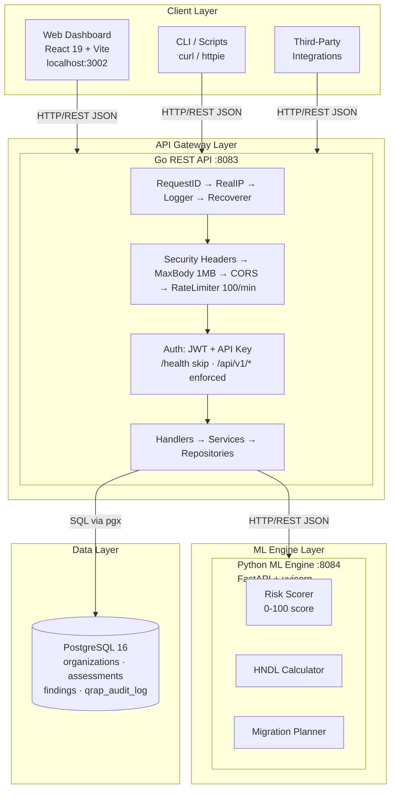
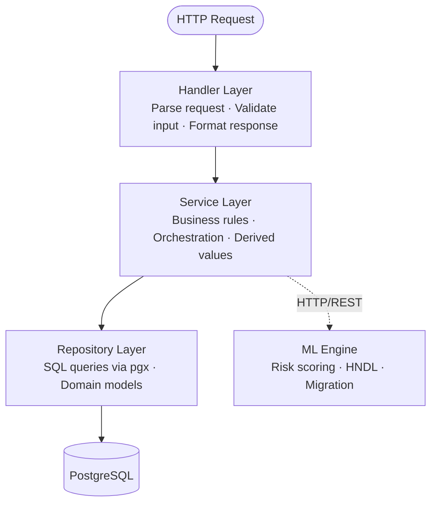
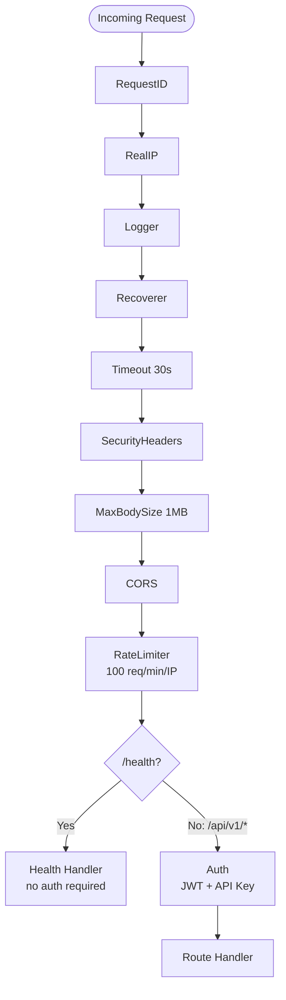
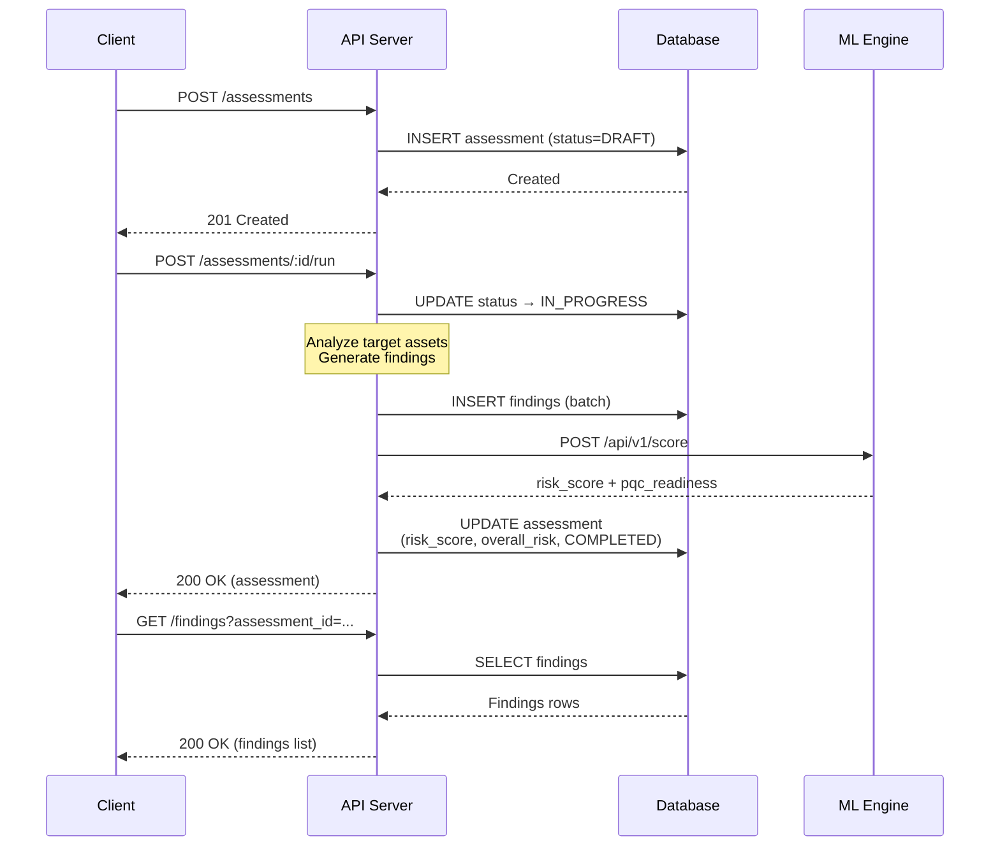
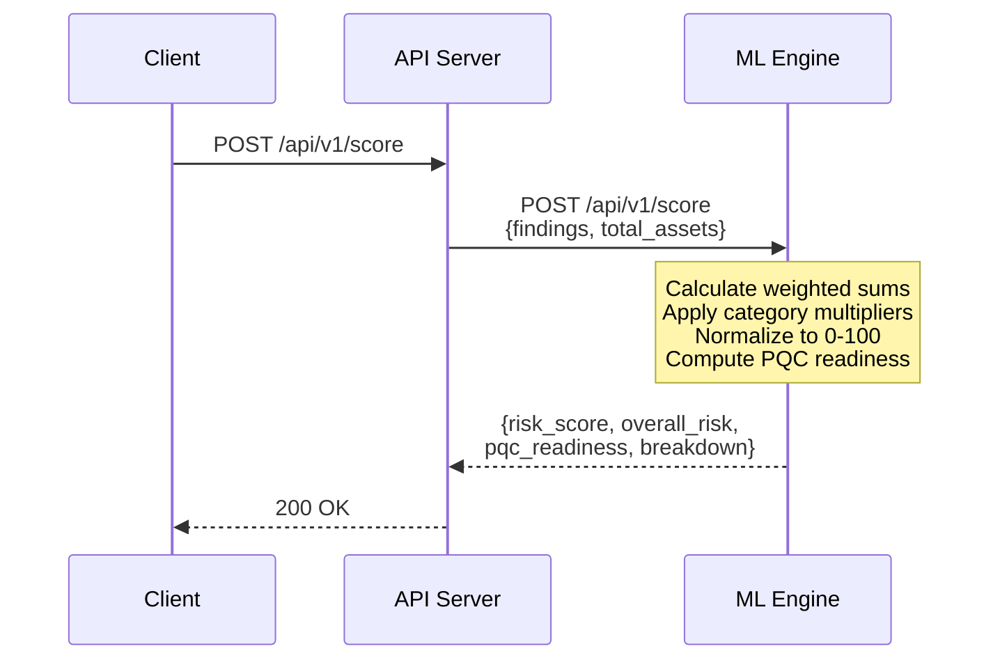
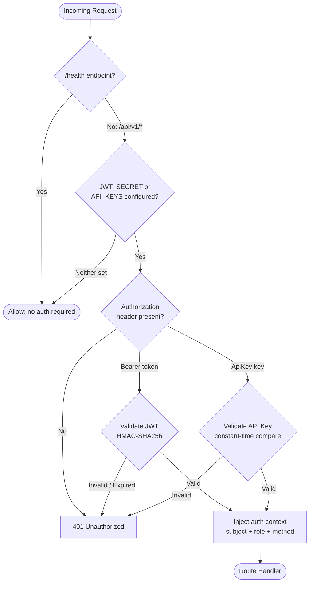
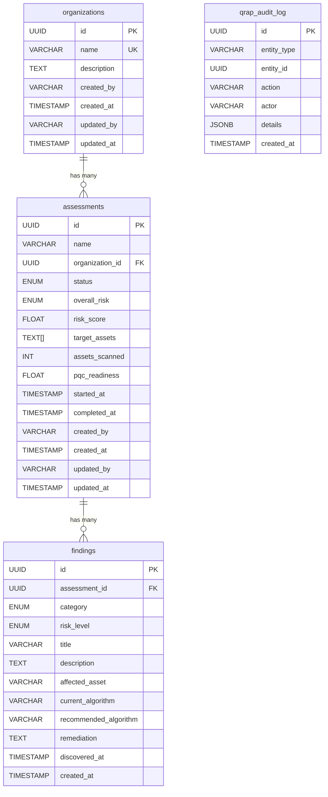

# Architecture

This document describes the architecture of QRAP (Quantum Risk Assessment Platform), including system design, component interactions, data flow, and technology choices.

## Table of Contents

- [Design Philosophy](#design-philosophy)
- [System Overview](#system-overview)
- [Component Architecture](#component-architecture)
  - [Go REST API](#go-rest-api)
  - [Python ML Engine](#python-ml-engine)
  - [Web Dashboard](#web-dashboard)
  - [Shared Libraries](#shared-libraries)
  - [Database](#database)
- [Data Flow](#data-flow)
- [Authentication and Authorization](#authentication-and-authorization)
- [Database Schema](#database-schema)
- [API Design Patterns](#api-design-patterns)
- [Error Handling](#error-handling)
- [Technology Choices](#technology-choices)

---

## Design Philosophy

QRAP is built on the following principles:

1. **Separation of concerns** -- The system is divided into three independently deployable services (API, ML engine, web dashboard), each responsible for a single domain.
2. **Security by default** -- Authentication, rate limiting, security headers, and parameterized queries are built into the foundation, not bolted on.
3. **Simplicity over abstraction** -- We prefer straightforward, readable code. The Go API has zero external web framework dependencies beyond Chi (a minimal router). The JWT implementation is dependency-free, using only the standard library's `crypto/hmac` and `crypto/subtle`.
4. **Polyglot pragmatism** -- Go for the API (concurrency, performance, static typing), Python for the ML engine (ecosystem, rapid iteration), React/TypeScript for the frontend (type safety, component model).
5. **Shared middleware, independent services** -- Cross-cutting concerns (auth, rate limiting, database pooling) live in a shared Go module, while each service maintains its own deployment boundary.

## System Overview



## Component Architecture

### Go REST API

**Location:** `api/`
**Module:** `github.com/yazhsab/qbitel-qrap/api`
**Port:** 8083

The API server is the central orchestrator. It handles all client requests, enforces authentication and rate limiting, manages business logic, and coordinates with the ML engine and database.

**Internal structure (Clean Architecture):**

```
api/
+-- cmd/
|   +-- server/main.go         Entrypoint: config, DI, router setup, graceful shutdown
|   +-- migrate/main.go        Migration CLI tool
+-- internal/
    +-- config/config.go        Environment-based configuration
    +-- handler/                HTTP layer: request parsing, validation, response formatting
    |   +-- health.go           GET /health
    |   +-- organization.go     CRUD for organizations
    |   +-- assessment.go       CRUD + Run for assessments
    |   +-- finding.go          Read-only findings access
    +-- model/                  Domain models + request/response DTOs
    |   +-- organization.go
    |   +-- assessment.go
    |   +-- finding.go
    +-- repository/             Data access layer (PostgreSQL via pgx)
    |   +-- organization_repo.go
    |   +-- assessment_repo.go
    |   +-- finding_repo.go
    +-- service/                Business logic layer
        +-- organization_service.go
        +-- assessment_service.go
        +-- finding_service.go
```

**Layered architecture:**
1. **Handler** -- Parses HTTP requests, validates input, returns JSON responses. No business logic.
2. **Service** -- Implements business rules, orchestrates repository calls, computes derived values.
3. **Repository** -- Executes SQL queries via pgx. Returns domain models.
4. **Model** -- Pure data structures. Includes `ToResponse()` methods for API serialization.



**Middleware stack (applied in order):**
1. `RequestID` -- Generates unique request IDs for tracing
2. `RealIP` -- Extracts client IP from proxy headers
3. `Logger` -- Structured request logging
4. `Recoverer` -- Panic recovery to prevent server crashes
5. `Timeout(30s)` -- Request timeout enforcement
6. `SecurityHeaders` -- HSTS, CSP, X-Frame-Options, X-Content-Type-Options
7. `MaxBodySize(1MB)` -- Request body size limit
8. `CORS` -- Cross-origin resource sharing (if configured)
9. `RateLimiter(100/min)` -- Per-IP sliding window rate limiting
10. `Auth` -- JWT/API key authentication (on `/api/v1/*` routes only)

**Middleware pipeline diagram:**



### Python ML Engine

**Location:** `ml/`
**Package:** `qrap-ml`
**Port:** 8084

The ML engine is a stateless microservice that provides three computational engines exposed via FastAPI.

```
ml/src/qrap_ml/
+-- api/app.py                  FastAPI application with endpoint definitions
+-- risk_scorer/scorer.py       Composite risk scoring (0-100)
+-- hndl_calculator/calculator.py   HNDL risk window calculation
+-- migration_planner/planner.py    PQC migration roadmap generation
```

**Engines:**

| Engine              | Input                        | Output                                     |
|---------------------|------------------------------|--------------------------------------------|
| **Risk Scorer**     | Findings + total asset count | Risk score (0-100), overall risk, PQC readiness, breakdown |
| **HNDL Calculator** | Algorithm + data shelf life  | Break year, risk window, urgency level     |
| **Migration Planner** | Assets with algorithms     | Prioritized migration steps with effort estimates |

**Risk scoring algorithm:**
- Each finding is weighted by severity (CRITICAL=10, HIGH=5, MEDIUM=2, LOW=1, INFO=0)
- Category multipliers increase urgency: HNDL (1.5x), MISSING_PQC (1.3x), WEAK_ALGORITHM (1.2x)
- Normalized to 0-100 scale against worst-case (all CRITICAL + HNDL)
- Overall risk: >=80 CRITICAL, >=60 HIGH, >=30 MEDIUM, <30 LOW

**HNDL calculation (Mosca inequality):**
- Uses conservative CRQC timeline estimates (e.g., RSA-2048 breakable by 2030)
- Risk window = data_shelf_life - years_until_break
- Urgency: >=10 years CRITICAL, >=5 HIGH, >0 MEDIUM, <=0 LOW

**Migration mapping:**
| Classical Algorithm | PQC Replacement     | Standard |
|---------------------|---------------------|----------|
| RSA-2048            | ML-KEM-768          | FIPS 203 |
| RSA-3072            | ML-KEM-768          | FIPS 203 |
| RSA-4096            | ML-KEM-1024         | FIPS 203 |
| ECDSA-P256          | ML-DSA-65           | FIPS 204 |
| ECDSA-P384          | ML-DSA-87           | FIPS 204 |
| Ed25519             | ML-DSA-65           | FIPS 204 |
| X25519              | X25519-ML-KEM-768   | Hybrid   |
| DH-2048             | ML-KEM-768          | FIPS 203 |

### Web Dashboard

**Location:** `web/`
**Package:** `@qbitel/qrap-web`
**Port:** 3002 (dev), 80 (production via nginx)

A single-page application built with React 19 and Vite 6.

```
web/src/
+-- App.tsx                 Router configuration and navigation
+-- main.tsx                React DOM entry point
+-- pages/
    +-- DashboardPage.tsx   Overview and summary metrics
    +-- AssessmentsPage.tsx Assessment management
    +-- FindingsPage.tsx    Finding browser with risk-level filtering
    +-- HndlPage.tsx        Interactive HNDL risk analysis
```

**Routes:**
| Path            | Component         | Description                |
|-----------------|-------------------|----------------------------|
| `/`             | DashboardPage     | Overview dashboard         |
| `/assessments`  | AssessmentsPage   | Assessment management      |
| `/findings`     | FindingsPage      | Finding browser            |
| `/hndl`         | HndlPage          | HNDL analysis tool         |

### Shared Libraries

**Location:** `shared/go/`
**Module:** `github.com/yazhsab/qbitel-qrap/shared/go`

Cross-cutting concerns extracted into a shared module that can be used by any Qbitel Go service.

| Package              | Purpose                                                |
|----------------------|--------------------------------------------------------|
| `database/pool.go`   | PostgreSQL connection pool (pgx) with production defaults: 25 max conns, 5 min conns, health checks |
| `middleware/auth.go`  | JWT (HMAC-SHA256) and API key authentication           |
| `middleware/ratelimit.go` | Per-key sliding window rate limiter with background cleanup |
| `middleware/security.go`  | Security headers, CORS, request body size limiting |
| `middleware/pagination.go` | Query parameter pagination parsing (offset/limit)  |
| `middleware/helpers.go`    | API key config string parsing                      |

### Database

**Engine:** PostgreSQL 16
**Migrations:** `db/migrations/` (golang-migrate format)

The database stores four tables plus supporting infrastructure. See the [Database Schema](#database-schema) section for details.

## Data Flow

### Assessment Execution Flow



### ML Engine Scoring Flow



## Authentication and Authorization

QRAP supports two authentication modes, both configured via environment variables.

### JWT Bearer Tokens (HMAC-SHA256)

```
Authorization: Bearer <jwt>
```

- Tokens are validated using HMAC-SHA256 with the `QUANTUN_JWT_SECRET`
- The `none` algorithm is explicitly rejected
- Claims validated: `exp` (expiration), `nbf` (not before), `iss` (issuer), `sub` (subject, required)
- Signature verification uses `crypto/subtle.ConstantTimeCompare` to prevent timing attacks

**Token payload structure:**
```json
{
  "sub": "user-id",
  "role": "admin",
  "iat": 1706140800,
  "exp": 1706227200,
  "nbf": 1706140800,
  "iss": "quantun",
  "jti": "unique-token-id"
}
```

### API Keys

```
Authorization: ApiKey <key>
```

- Configured as comma-separated `key:subject:role` entries in `QUANTUN_API_KEYS`
- Validation iterates over all configured keys using `subtle.ConstantTimeCompare` for every entry, preventing timing side-channel attacks that could reveal key existence

### Auth Context

On successful authentication, three values are injected into the request context:
- `auth.subject` -- The authenticated identity (user ID or service name)
- `auth.role` -- The role associated with the identity
- `auth.method` -- Either `jwt` or `api_key`

### Unauthenticated Mode

When neither `QUANTUN_JWT_SECRET` nor `QUANTUN_API_KEYS` is configured, all endpoints are accessible without authentication. The `/health` endpoint always bypasses authentication.

### Authentication Decision Flow



## Database Schema

### Entity Relationship Diagram



### Enum Types

**risk_level:** `CRITICAL | HIGH | MEDIUM | LOW | INFO`

**assessment_status:** `DRAFT | IN_PROGRESS | COMPLETED | ARCHIVED`

**finding_category:**
| Value                      | Description                                    |
|----------------------------|------------------------------------------------|
| `WEAK_ALGORITHM`           | Algorithm with known cryptographic weaknesses  |
| `SHORT_KEY_LENGTH`         | Key length below recommended minimums          |
| `DEPRECATED_PROTOCOL`      | Use of deprecated protocol versions            |
| `MISSING_PQC`              | No post-quantum cryptography protection        |
| `CERTIFICATE_EXPIRY`       | Certificate approaching or past expiry         |
| `HARVEST_NOW_DECRYPT_LATER`| Vulnerable to quantum harvest-now attacks      |

### Indexes

| Table          | Index                         | Columns                      |
|----------------|-------------------------------|------------------------------|
| assessments    | `idx_assessments_org`         | `organization_id`            |
| assessments    | `idx_assessments_status`      | `status`                     |
| assessments    | `idx_assessments_risk`        | `overall_risk`               |
| findings       | `idx_findings_assessment`     | `assessment_id`              |
| findings       | `idx_findings_risk_level`     | `risk_level`                 |
| findings       | `idx_findings_category`       | `category`                   |
| qrap_audit_log | `idx_qrap_audit_entity`       | `entity_type, entity_id`     |
| qrap_audit_log | `idx_qrap_audit_created`      | `created_at`                 |

### Triggers

- **`trg_organizations_updated_at`** -- Automatically sets `updated_at = NOW()` on organization updates
- **`trg_assessments_updated_at`** -- Automatically sets `updated_at = NOW()` on assessment updates

## API Design Patterns

### RESTful Resource Naming
- Resources are plural nouns: `/organizations`, `/assessments`, `/findings`
- Nested actions use verbs: `/assessments/{id}/run`
- API is versioned via URL path: `/api/v1/`

### Response Envelope
All list endpoints return paginated responses:

```json
{
  "organizations": [...],
  "total_count": 42,
  "offset": 0,
  "limit": 20
}
```

### Pagination
- Controlled via `offset` and `limit` query parameters
- Default limit: 20, maximum limit: 100, maximum offset: 1,000,000
- Invalid values fall back to defaults silently

### Content Type
- All requests and responses use `application/json`
- Timestamps use RFC 3339 format (e.g., `2026-01-15T10:30:00Z`)
- UUIDs use standard format (e.g., `550e8400-e29b-41d4-a716-446655440000`)

## Error Handling

### Error Response Format

All errors return a JSON object with a single `error` field:

```json
{
  "error": "description of the error"
}
```

### HTTP Status Codes

| Code | Meaning                | When Used                                        |
|------|------------------------|--------------------------------------------------|
| 200  | OK                     | Successful read or action                        |
| 201  | Created                | Resource successfully created                    |
| 400  | Bad Request            | Invalid input, missing required fields           |
| 401  | Unauthorized           | Missing or invalid authentication                |
| 403  | Forbidden              | Authenticated but insufficient permissions       |
| 404  | Not Found              | Resource does not exist                          |
| 413  | Payload Too Large      | Request body exceeds 1 MB                        |
| 429  | Too Many Requests      | Rate limit exceeded (includes Retry-After header)|
| 500  | Internal Server Error  | Unexpected server-side failure                   |

### Rate Limit Headers

When rate limiting is active, all responses include:

```
X-RateLimit-Limit: 100
X-RateLimit-Remaining: 97
X-RateLimit-Reset: 60
```

When the limit is exceeded, the response also includes:

```
Retry-After: 45
```

## Technology Choices

| Component     | Technology              | Rationale                                           |
|---------------|-------------------------|-----------------------------------------------------|
| API           | Go 1.23 + Chi v5        | High performance, strong typing, minimal dependencies, excellent concurrency model |
| ML Engine     | Python 3.11+ + FastAPI  | Rich ML ecosystem (numpy, scikit-learn), fast development, automatic OpenAPI docs |
| Web Dashboard | React 19 + Vite 6       | Component model, TypeScript safety, fast HMR development |
| Database      | PostgreSQL 16           | Robust, ACID-compliant, native UUID and JSONB support, enum types, array columns |
| DB Driver     | pgx v5                  | Pure Go, high performance, connection pooling, prepared statements |
| Auth          | Custom HMAC-SHA256      | Zero dependencies, constant-time comparison, explicit algorithm rejection |
| Logging       | zap                     | Structured logging, zero-allocation in hot paths    |
| Container     | Docker + multi-stage    | Minimal images (Alpine-based), reproducible builds  |
| CI/CD         | GitHub Actions          | Native GitHub integration, parallel job execution   |
| Migrations    | golang-migrate          | SQL-native, version-controlled schema changes       |
