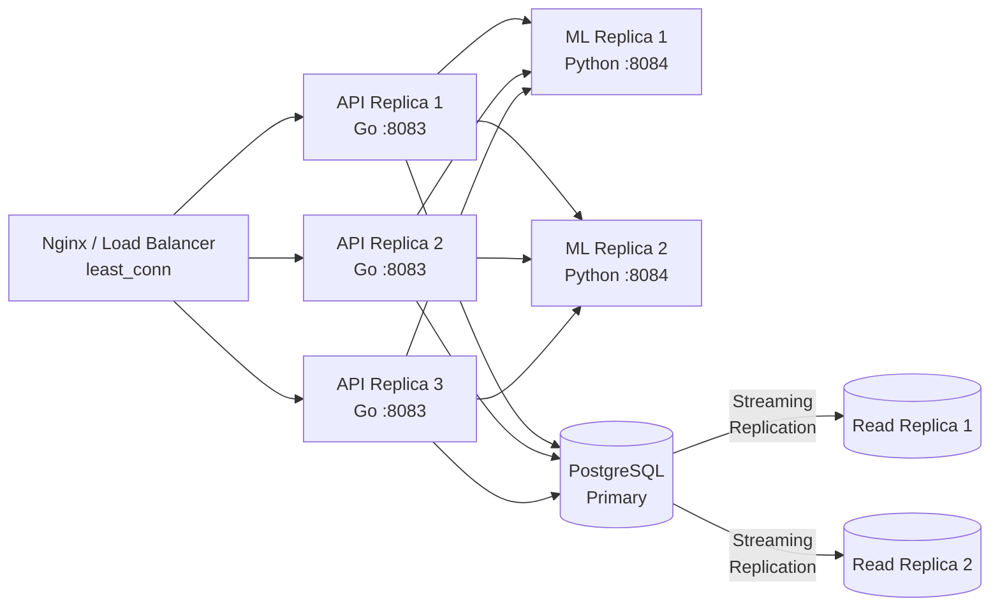
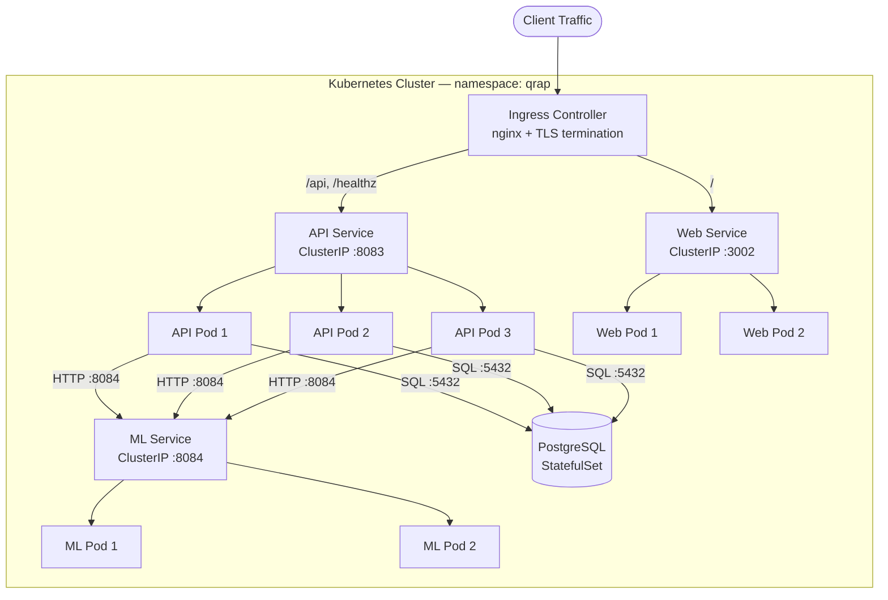

# Deployment Guide

This guide covers production deployment of QRAP (Quantum Risk Assessment Platform), including Docker Compose, Kubernetes, database management, reverse proxy configuration, monitoring, and security hardening.

## Table of Contents

- [Prerequisites](#prerequisites)
- [Docker Compose Production Setup](#docker-compose-production-setup)
- [Environment Variable Reference](#environment-variable-reference)
- [Database Setup](#database-setup)
- [Reverse Proxy Configuration](#reverse-proxy-configuration)
- [TLS/SSL Termination](#tlsssl-termination)
- [Monitoring](#monitoring)
- [Backup Strategy](#backup-strategy)
- [Scaling](#scaling)
- [Kubernetes Deployment](#kubernetes-deployment)
- [Security Hardening Checklist](#security-hardening-checklist)

---

## Prerequisites

- Docker 24+ and Docker Compose v2
- PostgreSQL 16 (or use the containerized instance)
- A domain name with DNS configured
- TLS certificates (Let's Encrypt recommended)
- Minimum 2 CPU cores, 4 GB RAM for a single-node deployment

---

## Docker Compose Production Setup

Create a `docker-compose.prod.yml` file with resource limits and production-grade settings:

```yaml
version: "3.9"

services:
  postgres:
    image: postgres:16-alpine
    restart: always
    environment:
      POSTGRES_DB: ${QRAP_DB_NAME:-qrap}
      POSTGRES_USER: ${QRAP_DB_USER:-qrap}
      POSTGRES_PASSWORD: ${QRAP_DB_PASSWORD}
    volumes:
      - pgdata:/var/lib/postgresql/data
    deploy:
      resources:
        limits:
          cpus: "1.0"
          memory: 1G
        reservations:
          cpus: "0.5"
          memory: 512M
    healthcheck:
      test: ["CMD-SHELL", "pg_isready -U ${QRAP_DB_USER:-qrap}"]
      interval: 10s
      timeout: 5s
      retries: 5

  api:
    build:
      context: .
      dockerfile: infra/Dockerfile.api
    restart: always
    ports:
      - "8083:8083"
    environment:
      QRAP_DB_HOST: postgres
      QRAP_DB_PORT: "5432"
      QRAP_DB_NAME: ${QRAP_DB_NAME:-qrap}
      QRAP_DB_USER: ${QRAP_DB_USER:-qrap}
      QRAP_DB_PASSWORD: ${QRAP_DB_PASSWORD}
      QRAP_ML_URL: http://ml:8084
      QUANTUN_JWT_SECRET: ${QUANTUN_JWT_SECRET}
      QUANTUN_JWT_ISSUER: ${QUANTUN_JWT_ISSUER:-qrap}
      QUANTUN_API_KEYS: ${QUANTUN_API_KEYS}
      QRAP_LOG_LEVEL: ${QRAP_LOG_LEVEL:-info}
    depends_on:
      postgres:
        condition: service_healthy
    deploy:
      resources:
        limits:
          cpus: "1.0"
          memory: 512M
        reservations:
          cpus: "0.25"
          memory: 256M
    healthcheck:
      test: ["CMD", "wget", "--spider", "-q", "http://localhost:8083/healthz"]
      interval: 15s
      timeout: 5s
      retries: 3

  ml:
    build:
      context: .
      dockerfile: infra/Dockerfile.ml
    restart: always
    ports:
      - "8084:8084"
    environment:
      QRAP_ML_LOG_LEVEL: ${QRAP_ML_LOG_LEVEL:-info}
    deploy:
      resources:
        limits:
          cpus: "2.0"
          memory: 2G
        reservations:
          cpus: "0.5"
          memory: 512M
    healthcheck:
      test: ["CMD", "curl", "-f", "http://localhost:8084/health"]
      interval: 15s
      timeout: 5s
      retries: 3

  web:
    build:
      context: .
      dockerfile: infra/Dockerfile.web
    restart: always
    ports:
      - "3002:3002"
    deploy:
      resources:
        limits:
          cpus: "0.5"
          memory: 256M
        reservations:
          cpus: "0.1"
          memory: 128M

volumes:
  pgdata:
```

Start the production stack:

```bash
docker compose -f docker-compose.prod.yml up -d
```

---

## Environment Variable Reference

### API Service (Go)

| Variable | Description | Default | Required |
|---|---|---|---|
| `QRAP_DB_HOST` | PostgreSQL hostname | `localhost` | Yes |
| `QRAP_DB_PORT` | PostgreSQL port | `5432` | No |
| `QRAP_DB_NAME` | Database name | `qrap` | No |
| `QRAP_DB_USER` | Database user | `qrap` | No |
| `QRAP_DB_PASSWORD` | Database password | -- | Yes |
| `QRAP_DB_SSLMODE` | PostgreSQL SSL mode | `require` | No |
| `QRAP_DB_MAX_CONNS` | Maximum connection pool size | `25` | No |
| `QRAP_DB_MIN_CONNS` | Minimum connection pool size | `5` | No |
| `QRAP_ML_URL` | ML engine base URL | `http://localhost:8084` | Yes |
| `QRAP_API_PORT` | API listen port | `8083` | No |
| `QRAP_LOG_LEVEL` | Log level (debug, info, warn, error) | `info` | No |
| `QRAP_RATE_LIMIT` | Requests per minute per IP | `100` | No |
| `QRAP_MAX_BODY_SIZE` | Maximum request body size in bytes | `1048576` (1 MB) | No |
| `QUANTUN_JWT_SECRET` | HMAC-SHA256 signing secret for JWTs | -- | Yes |
| `QUANTUN_JWT_ISSUER` | JWT issuer claim | `qrap` | No |
| `QUANTUN_API_KEYS` | Comma-separated list of valid API keys | -- | Yes |

### ML Engine (Python)

| Variable | Description | Default | Required |
|---|---|---|---|
| `QRAP_ML_PORT` | ML engine listen port | `8084` | No |
| `QRAP_ML_LOG_LEVEL` | Log level | `info` | No |
| `QRAP_ML_WORKERS` | Number of Uvicorn workers | `2` | No |

### Web Dashboard (React)

| Variable | Description | Default | Required |
|---|---|---|---|
| `VITE_QRAP_API_URL` | API base URL for the frontend | `http://localhost:8083` | Yes |

---

## Database Setup

### PostgreSQL 16 Installation

For a dedicated PostgreSQL instance:

```bash
# Ubuntu/Debian
sudo apt-get install postgresql-16

# Create the database and user
sudo -u postgres psql <<EOF
CREATE USER qrap WITH PASSWORD 'your-secure-password';
CREATE DATABASE qrap OWNER qrap;
GRANT ALL PRIVILEGES ON DATABASE qrap TO qrap;
EOF
```

### Connection Pooling

For production workloads, deploy PgBouncer in front of PostgreSQL:

```ini
# pgbouncer.ini
[databases]
qrap = host=127.0.0.1 port=5432 dbname=qrap

[pgbouncer]
listen_addr = 0.0.0.0
listen_port = 6432
auth_type = md5
auth_file = /etc/pgbouncer/userlist.txt
pool_mode = transaction
max_client_conn = 200
default_pool_size = 25
min_pool_size = 5
reserve_pool_size = 5
reserve_pool_timeout = 3
```

Point `QRAP_DB_HOST` and `QRAP_DB_PORT` at the PgBouncer instance instead of PostgreSQL directly.

### Running Migrations

Migrations are stored in the `db/migrations/` directory and should be applied before starting the API service:

```bash
# Using the Makefile
make migrate

# Manual execution
for f in db/migrations/*.up.sql; do
  psql -h $QRAP_DB_HOST -U $QRAP_DB_USER -d $QRAP_DB_NAME -f "$f"
done
```

### Core Tables

The database schema includes:

- **organizations** -- Tenant/organization records
- **assessments** -- Cryptographic risk assessments
- **findings** -- Individual findings within assessments
- **qrap_audit_log** -- Immutable audit trail of all API operations

---

## Reverse Proxy Configuration

### Nginx

```nginx
upstream qrap_api {
    server 127.0.0.1:8083;
    keepalive 32;
}

upstream qrap_web {
    server 127.0.0.1:3002;
}

server {
    listen 443 ssl http2;
    server_name qrap.example.com;

    ssl_certificate     /etc/ssl/certs/qrap.example.com.crt;
    ssl_certificate_key /etc/ssl/private/qrap.example.com.key;

    # Security headers (supplement QRAP's built-in headers)
    add_header X-Frame-Options "DENY" always;
    add_header X-Content-Type-Options "nosniff" always;
    add_header Referrer-Policy "strict-origin-when-cross-origin" always;

    # API routes
    location /api/ {
        proxy_pass http://qrap_api;
        proxy_set_header Host $host;
        proxy_set_header X-Real-IP $remote_addr;
        proxy_set_header X-Forwarded-For $proxy_add_x_forwarded_for;
        proxy_set_header X-Forwarded-Proto $scheme;

        proxy_connect_timeout 10s;
        proxy_read_timeout 30s;
        proxy_send_timeout 30s;

        client_max_body_size 1m;
    }

    # Health check (no auth)
    location /healthz {
        proxy_pass http://qrap_api;
    }

    # Web dashboard
    location / {
        proxy_pass http://qrap_web;
        proxy_set_header Host $host;
        proxy_set_header X-Real-IP $remote_addr;
        proxy_set_header X-Forwarded-For $proxy_add_x_forwarded_for;
        proxy_set_header X-Forwarded-Proto $scheme;
    }
}

server {
    listen 80;
    server_name qrap.example.com;
    return 301 https://$host$request_uri;
}
```

### Caddy

```caddyfile
qrap.example.com {
    # API routes
    handle /api/* {
        reverse_proxy localhost:8083
    }

    handle /healthz {
        reverse_proxy localhost:8083
    }

    # Web dashboard
    handle {
        reverse_proxy localhost:3002
    }
}
```

Caddy handles TLS certificate provisioning and renewal automatically via Let's Encrypt.

---

## TLS/SSL Termination

### Let's Encrypt with Certbot

```bash
# Install certbot
sudo apt-get install certbot python3-certbot-nginx

# Obtain certificate
sudo certbot --nginx -d qrap.example.com

# Automatic renewal (crontab)
0 3 * * * certbot renew --quiet --post-hook "systemctl reload nginx"
```

### TLS Best Practices

Add the following to your Nginx `http` block for strong TLS configuration:

```nginx
ssl_protocols TLSv1.2 TLSv1.3;
ssl_ciphers ECDHE-ECDSA-AES128-GCM-SHA256:ECDHE-RSA-AES128-GCM-SHA256:ECDHE-ECDSA-AES256-GCM-SHA384:ECDHE-RSA-AES256-GCM-SHA384;
ssl_prefer_server_ciphers off;
ssl_session_cache shared:SSL:10m;
ssl_session_timeout 1d;
ssl_session_tickets off;
ssl_stapling on;
ssl_stapling_verify on;
```

---

## Monitoring

### Health Endpoints

| Endpoint | Port | Description |
|---|---|---|
| `GET /healthz` | 8083 | API liveness check |
| `GET /health` | 8084 | ML engine liveness check |

Health checks return HTTP 200 when the service is ready to accept traffic. The API health endpoint also verifies database connectivity.

### Structured Logging

QRAP uses **zap** for structured JSON logging in the Go API. Log output is written to stdout and can be collected by any log aggregation system.

Example log entry:

```json
{
  "level": "info",
  "ts": "2026-02-20T10:15:30.123Z",
  "caller": "api/handler.go:42",
  "msg": "assessment created",
  "org_id": "org_abc123",
  "assessment_id": "asmnt_def456",
  "duration_ms": 23.4
}
```

### Log Aggregation

Forward structured logs to your preferred aggregation system:

- **ELK Stack**: Use Filebeat to ship stdout logs to Elasticsearch.
- **Grafana Loki**: Use Promtail or the Docker logging driver.
- **Datadog / New Relic**: Use their respective Docker log collection agents.

### Metrics

Expose application metrics for Prometheus scraping by configuring your monitoring stack to poll the health endpoints and parse structured logs. Key metrics to track:

- Request latency (p50, p95, p99)
- Request rate by endpoint
- Error rate (4xx, 5xx)
- Database connection pool utilization
- ML engine inference latency
- Active assessment count

---

## Backup Strategy

### pg_dump (Logical Backups)

```bash
# Full database dump (compressed)
pg_dump -h $QRAP_DB_HOST -U $QRAP_DB_USER -d $QRAP_DB_NAME \
  --format=custom --compress=9 \
  -f "qrap_backup_$(date +%Y%m%d_%H%M%S).dump"

# Restore from backup
pg_restore -h $QRAP_DB_HOST -U $QRAP_DB_USER -d $QRAP_DB_NAME \
  --clean --if-exists \
  qrap_backup_20260220_100000.dump
```

### Automated Backup Schedule

```bash
# /etc/cron.d/qrap-backup
# Daily full backup at 2:00 AM
0 2 * * * postgres pg_dump -h localhost -U qrap -d qrap \
  --format=custom --compress=9 \
  -f /var/backups/qrap/qrap_$(date +\%Y\%m\%d).dump

# Retain 30 days of backups
0 3 * * * postgres find /var/backups/qrap -name "*.dump" -mtime +30 -delete
```

### Point-in-Time Recovery (PITR)

For point-in-time recovery, enable WAL archiving in `postgresql.conf`:

```ini
wal_level = replica
archive_mode = on
archive_command = 'cp %p /var/lib/postgresql/wal_archive/%f'
```

To recover to a specific point in time:

```bash
# Stop PostgreSQL
sudo systemctl stop postgresql

# Restore the base backup
pg_basebackup -D /var/lib/postgresql/16/main -Ft -z -P

# Create recovery.signal and configure recovery target
cat > /var/lib/postgresql/16/main/postgresql.auto.conf <<EOF
restore_command = 'cp /var/lib/postgresql/wal_archive/%f %p'
recovery_target_time = '2026-02-20 09:00:00 UTC'
recovery_target_action = 'promote'
EOF

touch /var/lib/postgresql/16/main/recovery.signal
sudo systemctl start postgresql
```

### Offsite Backup Storage

Upload backups to object storage for disaster recovery:

```bash
# AWS S3
aws s3 cp qrap_backup_20260220.dump s3://your-bucket/qrap-backups/

# Google Cloud Storage
gsutil cp qrap_backup_20260220.dump gs://your-bucket/qrap-backups/
```

---

## Scaling

**Horizontal scaling architecture:**



### Horizontal API Scaling

The Go API is stateless and can be horizontally scaled behind a load balancer:

```yaml
# docker-compose.prod.yml addition
services:
  api:
    deploy:
      replicas: 3
      resources:
        limits:
          cpus: "1.0"
          memory: 512M
```

Update the Nginx upstream to load balance across instances:

```nginx
upstream qrap_api {
    least_conn;
    server api-1:8083;
    server api-2:8083;
    server api-3:8083;
    keepalive 32;
}
```

### ML Engine Scaling

The Python ML engine can be scaled by increasing Uvicorn workers or running multiple containers:

```bash
# Increase workers within a single container
QRAP_ML_WORKERS=4

# Or scale containers
docker compose -f docker-compose.prod.yml up -d --scale ml=3
```

For compute-intensive workloads, consider placing ML engine instances on GPU-capable nodes.

### Database Read Replicas

For read-heavy workloads, configure PostgreSQL streaming replication:

```ini
# Primary: postgresql.conf
wal_level = replica
max_wal_senders = 5
wal_keep_size = 1024

# Replica: recovery configuration
primary_conninfo = 'host=primary-host port=5432 user=replicator password=secret'
```

Route read-only queries (such as assessment listing and dashboard data) to replicas while directing writes to the primary.

---

## Kubernetes Deployment

**Kubernetes topology overview:**



### Namespace

```yaml
apiVersion: v1
kind: Namespace
metadata:
  name: qrap
```

### ConfigMap

```yaml
apiVersion: v1
kind: ConfigMap
metadata:
  name: qrap-config
  namespace: qrap
data:
  QRAP_DB_HOST: "postgres.qrap.svc.cluster.local"
  QRAP_DB_PORT: "5432"
  QRAP_DB_NAME: "qrap"
  QRAP_DB_USER: "qrap"
  QRAP_DB_SSLMODE: "require"
  QRAP_DB_MAX_CONNS: "25"
  QRAP_DB_MIN_CONNS: "5"
  QRAP_ML_URL: "http://ml.qrap.svc.cluster.local:8084"
  QRAP_API_PORT: "8083"
  QRAP_LOG_LEVEL: "info"
  QRAP_RATE_LIMIT: "100"
  QUANTUN_JWT_ISSUER: "qrap"
```

### Secret

```yaml
apiVersion: v1
kind: Secret
metadata:
  name: qrap-secrets
  namespace: qrap
type: Opaque
stringData:
  QRAP_DB_PASSWORD: "your-secure-db-password"
  QUANTUN_JWT_SECRET: "your-256-bit-secret"
  QUANTUN_API_KEYS: "key1,key2,key3"
```

### API Deployment and Service

```yaml
apiVersion: apps/v1
kind: Deployment
metadata:
  name: api
  namespace: qrap
  labels:
    app: qrap-api
spec:
  replicas: 3
  selector:
    matchLabels:
      app: qrap-api
  template:
    metadata:
      labels:
        app: qrap-api
    spec:
      containers:
        - name: api
          image: ghcr.io/yazhsab/qbitel-qrap-api:0.1.0
          ports:
            - containerPort: 8083
          envFrom:
            - configMapRef:
                name: qrap-config
            - secretRef:
                name: qrap-secrets
          resources:
            requests:
              cpu: 250m
              memory: 256Mi
            limits:
              cpu: "1"
              memory: 512Mi
          livenessProbe:
            httpGet:
              path: /healthz
              port: 8083
            initialDelaySeconds: 10
            periodSeconds: 15
          readinessProbe:
            httpGet:
              path: /healthz
              port: 8083
            initialDelaySeconds: 5
            periodSeconds: 10
---
apiVersion: v1
kind: Service
metadata:
  name: api
  namespace: qrap
spec:
  selector:
    app: qrap-api
  ports:
    - port: 8083
      targetPort: 8083
  type: ClusterIP
```

### ML Engine Deployment and Service

```yaml
apiVersion: apps/v1
kind: Deployment
metadata:
  name: ml
  namespace: qrap
  labels:
    app: qrap-ml
spec:
  replicas: 2
  selector:
    matchLabels:
      app: qrap-ml
  template:
    metadata:
      labels:
        app: qrap-ml
    spec:
      containers:
        - name: ml
          image: ghcr.io/yazhsab/qbitel-qrap-ml:0.1.0
          ports:
            - containerPort: 8084
          env:
            - name: QRAP_ML_LOG_LEVEL
              value: "info"
            - name: QRAP_ML_WORKERS
              value: "2"
          resources:
            requests:
              cpu: 500m
              memory: 512Mi
            limits:
              cpu: "2"
              memory: 2Gi
          livenessProbe:
            httpGet:
              path: /health
              port: 8084
            initialDelaySeconds: 15
            periodSeconds: 15
          readinessProbe:
            httpGet:
              path: /health
              port: 8084
            initialDelaySeconds: 10
            periodSeconds: 10
---
apiVersion: v1
kind: Service
metadata:
  name: ml
  namespace: qrap
spec:
  selector:
    app: qrap-ml
  ports:
    - port: 8084
      targetPort: 8084
  type: ClusterIP
```

### Web Dashboard Deployment and Service

```yaml
apiVersion: apps/v1
kind: Deployment
metadata:
  name: web
  namespace: qrap
  labels:
    app: qrap-web
spec:
  replicas: 2
  selector:
    matchLabels:
      app: qrap-web
  template:
    metadata:
      labels:
        app: qrap-web
    spec:
      containers:
        - name: web
          image: ghcr.io/yazhsab/qbitel-qrap-web:0.1.0
          ports:
            - containerPort: 3002
          resources:
            requests:
              cpu: 100m
              memory: 128Mi
            limits:
              cpu: 500m
              memory: 256Mi
---
apiVersion: v1
kind: Service
metadata:
  name: web
  namespace: qrap
spec:
  selector:
    app: qrap-web
  ports:
    - port: 3002
      targetPort: 3002
  type: ClusterIP
```

### Ingress

```yaml
apiVersion: networking.k8s.io/v1
kind: Ingress
metadata:
  name: qrap-ingress
  namespace: qrap
  annotations:
    cert-manager.io/cluster-issuer: letsencrypt-prod
    nginx.ingress.kubernetes.io/proxy-body-size: "1m"
spec:
  ingressClassName: nginx
  tls:
    - hosts:
        - qrap.example.com
      secretName: qrap-tls
  rules:
    - host: qrap.example.com
      http:
        paths:
          - path: /api
            pathType: Prefix
            backend:
              service:
                name: api
                port:
                  number: 8083
          - path: /healthz
            pathType: Exact
            backend:
              service:
                name: api
                port:
                  number: 8083
          - path: /
            pathType: Prefix
            backend:
              service:
                name: web
                port:
                  number: 3002
```

---

## Security Hardening Checklist

Use this checklist before going to production:

- [ ] **Secrets management**: All secrets are stored in environment variables or a secrets manager (never committed to version control)
- [ ] **JWT secret strength**: `QUANTUN_JWT_SECRET` is at least 256 bits of cryptographically random data
- [ ] **API key rotation**: API keys are unique per client and can be rotated without downtime
- [ ] **TLS everywhere**: All external traffic uses TLS 1.2 or higher; internal traffic uses TLS or a private network
- [ ] **Database access**: PostgreSQL only accepts connections from application hosts; no public exposure
- [ ] **Database credentials**: Unique credentials per environment; production credentials never shared with development
- [ ] **Network segmentation**: ML engine and database are not directly accessible from the internet
- [ ] **Rate limiting**: Per-IP rate limiting is enabled (default: 100 requests/minute)
- [ ] **Request size limits**: Maximum request body size is enforced (default: 1 MB)
- [ ] **Security headers**: HSTS, CSP, X-Frame-Options, and X-Content-Type-Options headers are active
- [ ] **Container images**: Images are built from minimal base images and scanned for vulnerabilities
- [ ] **Non-root containers**: All containers run as non-root users
- [ ] **Read-only filesystems**: Container filesystems are mounted read-only where possible
- [ ] **Log redaction**: Sensitive data (tokens, passwords) is never written to logs
- [ ] **Audit logging**: The `qrap_audit_log` table captures all significant operations
- [ ] **Backups verified**: Backup restoration has been tested and recovery time is documented
- [ ] **Dependency scanning**: Go, Python, and npm dependencies are regularly scanned for known vulnerabilities
- [ ] **Graceful shutdown**: Services handle SIGTERM and drain active connections before exiting
